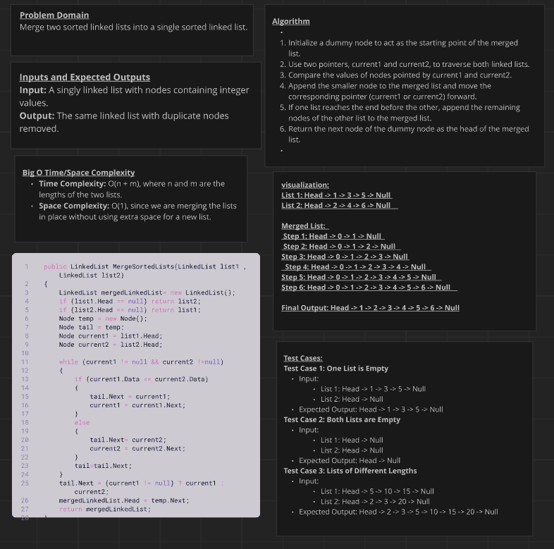
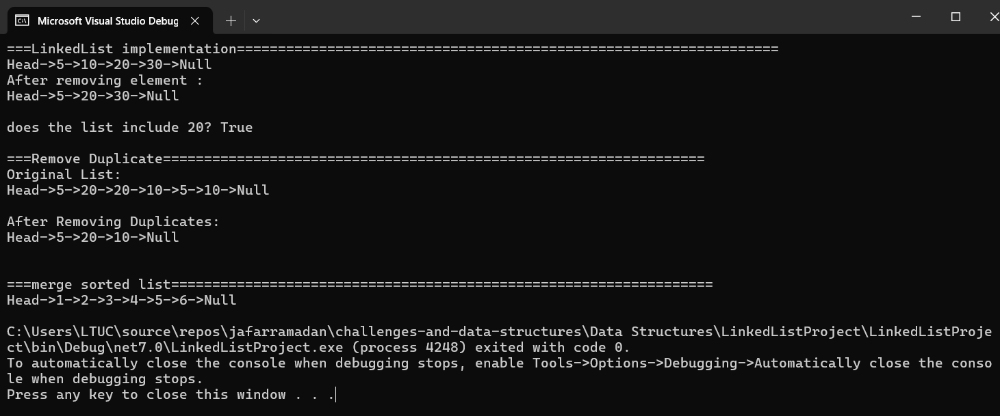

# Linked List Merge Sorted Lists

### Descreption :
This project involves merging two sorted linked lists into a single sorted linked list. Using the existing Node and LinkedList classes, we implement a method MergeSortedLists that merges the lists by comparing the values of nodes from each list and appending the smaller node to the merged list. The method handles various scenarios, such as when one or both input lists are empty or when the lists have different lengths or overlapping values. The goal is to ensure the merged list maintains the sorted order of the original lists. The project includes multiple test cases to verify the correctness of the implementation, ensuring it performs accurately under different conditions.

### whitboard image :

### Output image:
