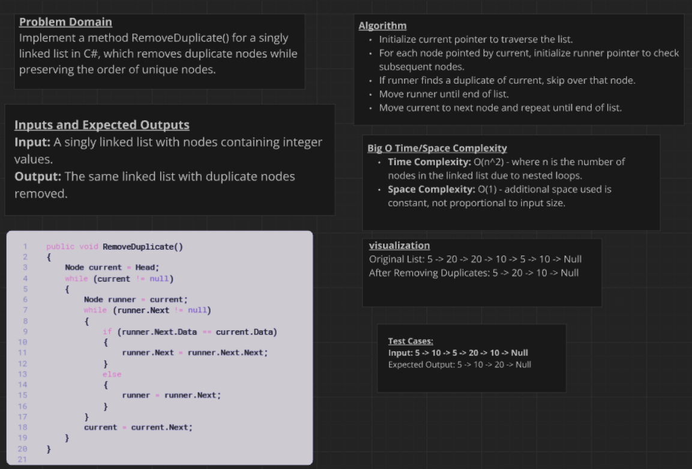
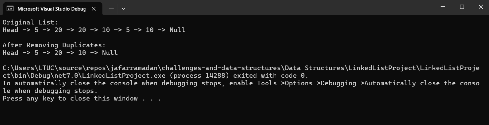

# Remove Duplicates
### Descreption :

This project extends a basic implementation of a singly linked list in C#. The linked list now includes a new method, `RemoveDuplicate()`, which removes duplicate nodes from the list. The method iterates through the list, using two pointers (`current` and `runner`), to detect and eliminate duplicates efficiently. Unit tests using xUnit ensure the correctness of the `RemoveDuplicate()` method across different scenarios, such as lists with no duplicates, mixed duplicates, and lists consisting entirely of duplicates. The `Program.cs` file demonstrates the usage of the `RemoveDuplicate()` method by initializing a linked list with nodes containing both unique and duplicate values, then verifying the modified list contents after removing duplicates.

### whitboard image :

### Output image:
