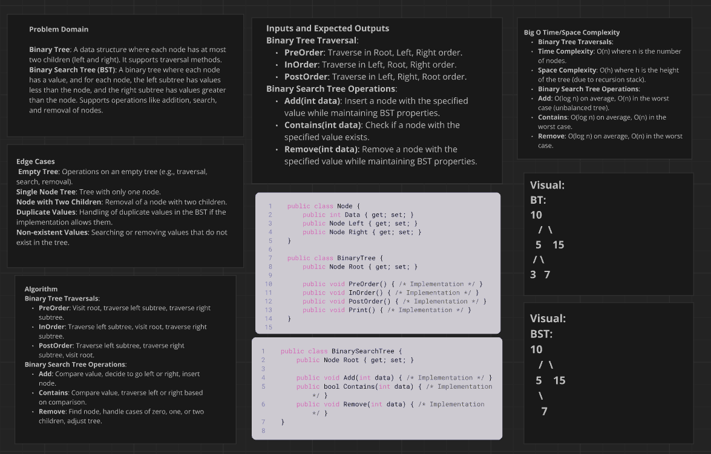
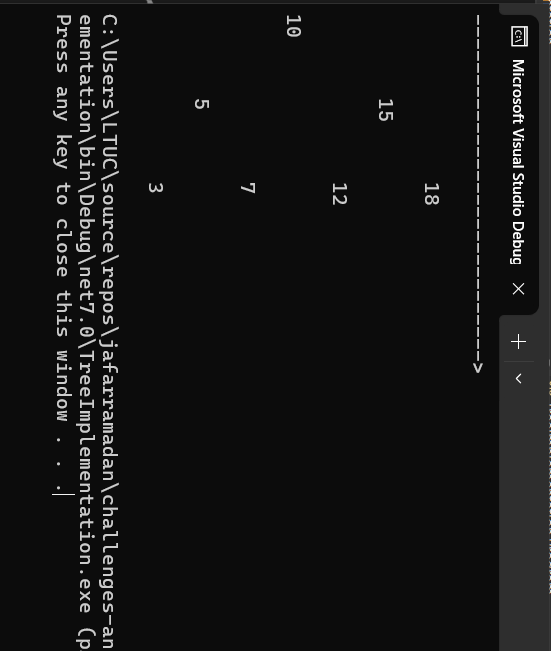

# Binary Tree and Binary Search Tree Implementation
## Description 
This project focuses on implementing and testing two essential tree data structures in C#: a Binary Tree and a Binary Search Tree (BST). The Binary Tree implementation includes various traversal methods—PreOrder, InOrder, and PostOrder—and a method to print the tree's structure in a readable format. The Binary Search Tree is designed to maintain an ordered structure, allowing for efficient operations such as adding nodes, checking for their existence, and removing them while preserving the tree’s properties. The solution is developed as a console application, and includes unit tests to ensure the correctness of both tree types. The final implementation, along with documentation and a screenshot of the console output, will be organized in a Git repository with a dedicated branch and folder structure.

## whitboard image :

## Output image:
