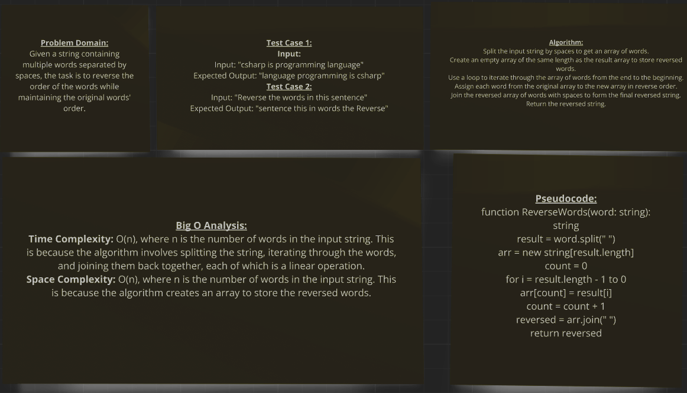
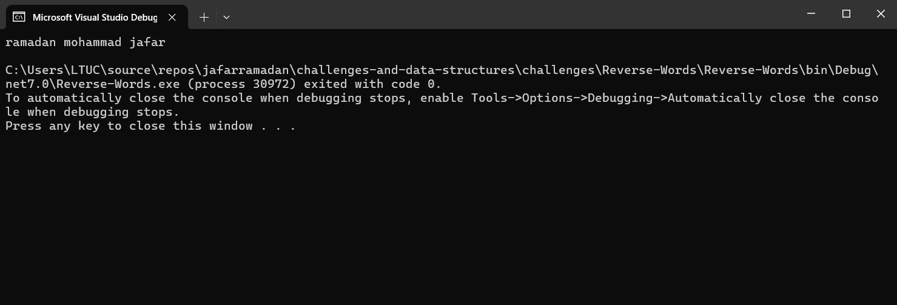

### Reverse Words

### Descreption
This C# program reverses the order of words in a given string.

### Usage

The program defines a `ReverseWords` method that takes a string as input, splits it into words, reverses the order of the words, and returns the reversed string.

### Example

For an input string `"jafar mohammad ramadan"`, the program outputs `"ramadan mohammad jafar"`.

### whitboard image :

### Output image:
